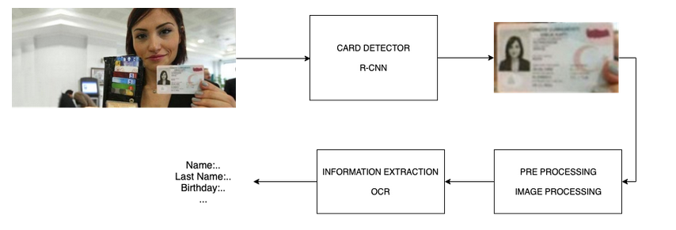
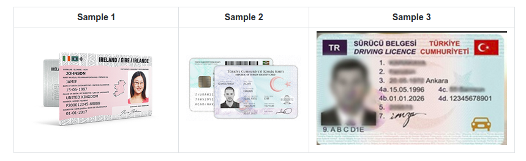

## ID Recognition

### Structure and Usage - 

#### Directories:
	test_images -
		which contains testing images.
	result - 
		it contains JSON object file which contains extracted information.
	model - 
		it contains our Faster RCNN model for detecting card images.
	
#### Files:
	adhaar_card_detail_extract.py - 
		the file will detect the adhaar card from the image, crop it and perform required text extraction from the image and save the output in ``result`` folder in JSON format.
	pan_card_detail_extract.py - 
		the file will detect the pan card from the image, crop it and perform required text extraction from the image and save the output in ``result`` folder in JSON format.
	id_card_detection_camera.py - 
		this file can be used to detect card in a live video stream through from a primary camera source.
	main.py - 
	    this file has combined both pan and adhaar text detection and is the final inference. Arguments are provided to it by command line.
	
#### Working with the model:
* To make the model to work with your images, put the Aadhar card image inside the ``test_images`` folder and pass in the path of the image to variable name ``image_path``.
* Also to get the output cropped image, pass the path (where you want to get the cropped image) for the variable ``output_path``. 
* The output JSON file will be present in ``result`` folder.

#### How to Run:
Tested on Python 3.5

##### Requirements:
* Tensorflow
* OpenCv
* pytesseract (refer [here](https://gitlab.iotiot.in/shunya/products/id-recognition/issues/14#note_16294) in case of installation difficulties)
* numpy 

1. To install the requirements.  
``pip install -r requirements.txt``
    
2. Runs the application with the default webcam. (To detect ID card in live video stream)  
``python id_card_detection_camera.py``

3. Runs the application with the image file.  
``python main.py ``

    **Arguments**
    
    1. **_--card_** - Type of Card (Adhaar/Pan) _[Default - 'adhaar']_ 
    2. **_--image_path_** - Path of input image _[Default - 'test_images/image_a1.jpeg']_
    3. **_--output_path_** - Path of store cropped image of card _[Default - 'test_images/output/output_a1.jpeg']_
    4. **_--json_folder_** - Folder to store the final json output _[Default - 'result']_ 
    

    
#### Steps/ Working Flow:
1. First, our **Faster RCNN model tries to Identity Regions of Interest (ROI) containing the required information with deep learning**.
2. If a card is detected it **creates a bounding box around it and crops that part of the image**.
3. That cropped image is then fed into our **OpenCV and pytesseract model** where we perform text extraction.
4. Our model extracts information such as **Name, Gender, DOB and UID from the image**.
5. The Extracted information is then printed and fed into a **JSON file, where it is saved**.

#### Use Case:

#### Sample ID Cards:

#### Model Accuracy and Performace:
1. The accuracy of our model mostly depends on the **quality of the image as well as the orientation**. 
    - In case of **Adhaar Card**, it detects _Name_ , _Gender_ , _Date of Birth_ and _UID_ . 
    - In case of **Pan Card**, it detects _Name_, _Father's Name_, _Date of Birth_ and _Pan Number_.
    
2. The Faster RCNN model is able to **achieve accuracy of more than 90% for detecting a card in the image.**
3. When the image quality is _low_ or image is _blurry or tilted_, then the pytesseract model give _some incorrect output_ like _confusing '0' with 'O' or 'D' and 'i' with 'l' or '1'_, but with a descent quality image it gives better results. 

** Create an empty 'result' directory inside the project before running main.py **
